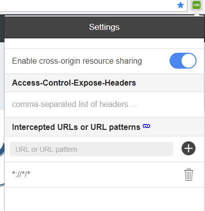
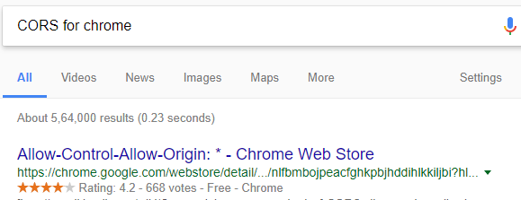

# Todo App With Angular5 With Backend support

This app is a sample for building Angular5 web app based on backend support.

## Demo
* [Todo App with mangodb support](http://tutorials.way2programming.com/apps/todo-app-with-mongodb-support/index.html)

## To run app in chrome

We need to install CORS for chrome tool then we will able to give GET, POST and DELETE request but only PATCH request will not work with tool.
<p align="center">
    
</p>
 
 Serach in goole for CORS tool and install it
 <p align="center">
    
</p>

### Prerequisites

We need to install the angular CLI 

```
> npm install -g @angular/cli
```

### Installing

need to install npm packages

```
> npm install
```

## Run server

```
> ng serve
```

## Built With

* [Angular5](https://angular.io/) - Angular is a platform that makes it easy to build applications with the web.
* [API- Express and Mongo](https://sleepy-citadel-54178.herokuapp.com/api/todos) - API running in different server and it is written in nodejs, express and mongodb.
* [Redux](https://redux.js.org/) - Redux is a predictable state container for JavaScript apps
* [@angular-redux/store](https://github.com/angular-redux/store) -  provides a set of npm packages that help you integrate your redux store into your Angular 2+ applications
* [Bulma](https://bulma.io/) - Bulma is an open source CSS framework based on Flexbox and built with Sass.
* [lodash](https://lodash.com/) - A JavaScript utility library delivering consistency, modularity, performance, & extras.
* [tassign](https://www.npmjs.com/package/tassign) - It is used that the reducer can only set known properties of Application state.

### Please use below link for backend for this APP

[Nodejs API for todo app with express and mongodb support- Git Repository](https://github.com/mdarif-k/nodejs-api-for-todo-app)


